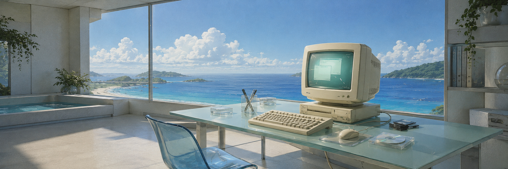

  

  <picture>
    <source
      media="(prefers-color-scheme: dark)"
      srcset="https://readme-typing-svg.demolab.com?font=IBM+Plex+Mono&weight=500&size=28&duration=3000&pause=1000&color=52E0C4&center=true&vCenter=true&width=680&lines=stay+quiet.;let+work+speak.;keep+learning.;move+on."
    />
    <source
      media="(prefers-color-scheme: light)"
      srcset="https://readme-typing-svg.demolab.com?font=IBM+Plex+Mono&weight=500&size=28&duration=3000&pause=1000&color=197C78&center=true&vCenter=true&width=680&lines=stay+quiet.;let+work+speak.;keep+learning.;move+on."
    />
    
  </picture>

  <a href="https://shaykiin-leung.github.io/">home</a>
  &nbsp;&nbsp;·&nbsp;&nbsp;
  <a href="https://github.com/Shaykiin-Leung?tab=repositories">projects</a>
  &nbsp;&nbsp;·&nbsp;&nbsp;
  <a href="https://github.com/Shaykiin-Leung">archive</a>

 

  somewhere between nostalgia and tomorrow.

